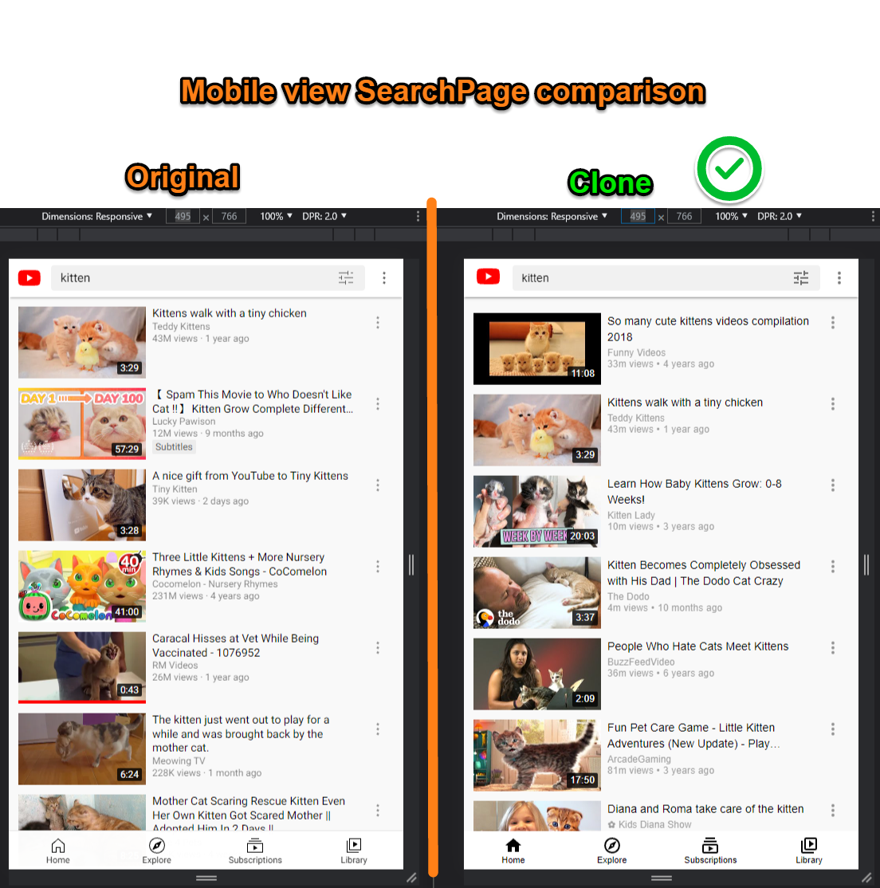

# React YouTube clone

## Demo of this app:


### Or Go to the live site and try it for yourself [here](https://react-youtubeclone.netlify.app/)

## WARNING
<strong> if the app does not load anything or the search function doesn't work, it is very likely the daily YouTube API quota has exceeded. There are only 5000 daily quotas for free usage, and each search costs 100 quotas. If the app doesn't work, I hope the animated GIF here can give you an idea of how it works. </strong>

## Mobile view search function demo


## What does this app do?

- It is a clone of YouTube HomePage and SearchPage.
- HomePage displays the most popular videos of the selected country by querying data from the YouTube API.
- HomePage utilizes infinite-scroll feature, so new videos thumbnails will load when the user keeps scrolling down the page.
- Typing a word and clicking on search does a real search on YouTube API, 25 results are displayed on the SearchPage.

## What is this project about?

- This is mainly a material-ui and styled-components learning project. I aimed at making the website look as close to the original YouTube as possible.
- This project ends up turning into a state and complexity management exercise too because as the project progressed, I realized it is much bigger than I thought.

## What technologies were used?

- react.js (create-react-app)
- react-router
- axios
- styled-components
- Material-UI v4
- jotai

## Links to source code and live site:

- [Live site hosted on Netlify](https://react-youtubeclone.netlify.app/)
- [Source code on Github](https://github.com/1codingguy/react-youtube-clone)

## Detailed side-by-side comparison of the clone to the original





## How to navigate this project? Click on the link for related source code:

1. Click on different countries in `ChipsBar` will display the most popular videos from that country, by querying the YouTube API. ([click here to view the `Chips` component](https://github.com/1codingguy/react-youtube-clone/blob/main/src/components/ChipsBar/Chips.jsx))

2. Header (Navbar) has different elements in different viewport size:
    - `HamburgerMenuIcon` is hidden in mobile view. ([click here for `LeftContainer` component for details](https://github.com/1codingguy/react-youtube-clone/blob/main/src/components/Header/LeftContainer/LeftContainer.jsx)) - `SearchBox` is hidden in mobile view, a drawer will appear when clicked on the search icon. And ([Click here to view relevant code](https://github.com/1codingguy/react-youtube-clone/blob/main/src/components/Header/MiddleContainer/MiddleContainer.jsx#L67)) - `SearchPage` has a different YouTube logo in mobile view. There is also a filter button next to the search box (albeit not functional).

3. `HamburgerMenuIcon` has different roles:
    - In larger screen toggles between mini and full-width sidebar; - in smaller screen opens a drawer. - [Click here for `HamburgerMenuIcon` component](https://github.com/1codingguy/react-youtube-clone/blob/main/src/components/Header/LeftContainer/HamburgerMenuIcon.jsx) - Content of Sidebar is different depends on the screen size. [Click here to show the code that decide what Sidebar to show](https://github.com/1codingguy/react-youtube-clone/blob/main/src/components/Sidebar/SidebarToShow.jsx#L12)

4. A popup menu will appear if clicked on `MoreButton` in each `VideoCard`. [Click here to view `MoreButton` component](https://github.com/1codingguy/react-youtube-clone/blob/main/src/components/Videos/MoreButton.jsx)

5. A search result can be a video or a channel, they have different content and are displayed differently in the SearchPage. [Click here to view the relevant code](https://github.com/1codingguy/react-youtube-clone/blob/main/src/components/Search/ResultsVideoCard.jsx#L64)
   

## Some notable differences between original YouTube and my clone:

1. ChipsBar has no left and right button, and no blur out effect, unlike the original YouTube.
   
2. From 1952px, 5 columns of video thumbnails are displayed in the original YouTube. But since material-ui has a 12-column grid layout, there's no way I can have 5 columns since 12/5 is not a whole number.

## Something you should expect when playing with the clone project:

- clicking on a row in any one of the popup menus will merely close the popup menu instead of routing to the another page.
- clicking on most of the buttons won't do anything.

## Why did I build the project this way?

1. Why ChipsBar lists different countries instead of keywords?

   - If using different keywords, clicking on a single chip will perform a search based on that keyword.
   - A search action costs 100 quotas on YouTube API, the daily quota is limited to 5000 for a free account.
   - Querying popular videos from different countries only costs 1 quota.
   - So ChipsBar is designed in this way because of the YouTube API quota.

2. Why use localStorage to save query results from YouTube?

- In the process of development I needed to load the SearchPage again and again, as each search action costs 100 quotas, daily limit quickly runs out.
- Quota was running out once and I had to pause the development process. To avoid such interruption I opted to use localStorage.
- Below picture shows my API quota was quickly used up without using localStorage.
  

## How can you clone and tweak this project?

From your command line, first clone this repo:

```
# Clone this repository
$ https://github.com/1codingguy/react-youtube-clone.git

# Go into the repository
$ cd react-youtube-clone

# Remove current origin repository
$ git remote remove origin

```

Then you can install the dependencies using NPM:

```
# Install dependencies
$ npm install

# Start development server
$ npm start
```

Happy coding!

---

## Author

**coding-guy**

- [GitHub](https://github.com/1codingguy)
- [Blog](https://blog.coding-guy.com/)
- [Twitter](https://twitter.com/1codingguy)
